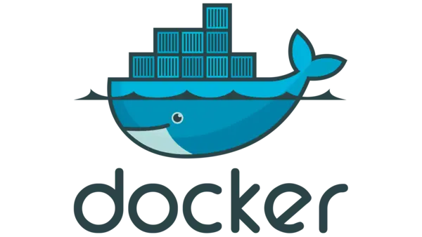

In this blog post, I will list the best practices when creating Dockerfiles. By
following these points, you can gain more confidence that your docker images are
secure and reliable.

# Using non-root user
The first and most important point when it comes to creating Dockerfiles is the avoidance
of running images using the root user. This is a key point if you want your docker
image to be as secure as possible. By default, Docker is using root as an account
that is performing all build steps and then running the docker entry-point
executable. By leaving the root user as it is and allowing programs inside
containers to be run by root, you are exposing yourself to huge risks. There are
cases when properly prepared, the exploit can escape the docker container due to root
privileges. When you are using a limited privilege account, such incidents are
close to impossible. The next thing is the risk when mounting directories to the docker
container. This is especially dangerous when you don't have access to
the Dockerfile of the image that you are running, and you don't know what is going on
under the hood. This might cause problems with files on a docker host, for example
removing important system configurations. To avoid such problems, always define
your custom user in Dockerfile:

```dockerfile
FROM ubuntu
RUN useradd -ms /bin/bash myuser
USER myuser
```

As an alternative, you can use an already existing non-root user from `/etc/passwd` in
base image.

If you want to run a docker image and force a user, you can use `-u` parameter. It
takes on option in the form `UID:GID`. So if you want to run some command as user
which UID and GID is 100 then add `-u` parameter like that:

```bash
docker run -u 100:100 ...
```

# Labels, volume, and expose aka documentation
Try to always define all labels that will help users of your image gain
knowledge about it very quickly. For example, you can add an author label to
give the user a contact point in case of problems with the image:

```dockerfile
LABEL org.opencontainers.image.authors="user@example.com"
```
Labels are commonly used to store information about the application and
dependencies version, for example, the base image tag. Labels have a form of
key-value pairs, so you are not limited to any kind of constraints when defining
Then.

The next documentation part of the Dockerfile is the `VOLUME` command. It has two main
roles. Firstly, it creates an external volume that will persist after the docker
run and makes sure that data that was defined in Dockerfile in the volume path
is copied to a new persistent volume. The next thing is information for the user that
a given directory in the docker container can be mounted to a custom location and
the contents of this directory are persistent.

The last documentation beat is the `EXPOSE` statement. It has a form of port and optional
protocol for example:

```dockerfile
EXPOSE 8080/tcp
```

This statement will help users quickly learn what ports are used by default by
applications built using a given Dockerfile. Those ports will also be listed along
with docker containers when the user gets the list of them via the `docker ps` command.

# Order of operations and frequency of changes
If you want to build your image as fast as possible, you need to order operations
in Dockerfile in a proper way. If you do it like that, then it will be possible to
reuse as many docker image layers as possible and run actual building commands
only in a few of them. This will improve build speed significantly. A general rule
of order of operations is that you need to put layers that will change most
often as the last ones in Dockerfile. Let's see the example of creating a Python docker
image with some web application in it:

```dockerfile
FROM python:3

# This section will probably not change
RUN mkdir /app
WORKDIR /app

# Dependencies will not change too often
ADD requirements.txt /app
RUN pip install -r /app/requirements.txt

# source code will change very often
ADD server.py /app
CMD [ "python", "./server.py" ]
```

By writing our Dockerfile like that, we make sure that when the source code is
changed (server.py file in that case)
building this image will take a very short. This is because all layers
including one with the installation of dependencies are reused in that case.

# Don't use the latest tag
It might be tempting to always tag your images using `latest` tags, but you
should avoid it. This tag can be very dangerous. Especially when your
production build is designed to use it.

In that case, we can imagine a situation where we update our application and the latest
tag is pushed. Then we deploy this image in production and there is some kind of
bug. Rolling back for this situation is very hard if we had not noted the image
identifier of the previous working image. You can optionally use the latest tag as an alias
to the tag that is currently deployed to production, but this should be treated only
as part of documentation and, you should not use the latest tag in your deployment.

There might be one more dangerous situation associated with using the latest tag.
If your docker deploy scripts are configured to always pull images from a remote
repository, then this might lead to an accidental unintended update of the application.
For example, if you are changing the configuration and this operation is leading to
docker container recreation (for example when changing environment vars) then
during this recreation, docker will download the latest tag and also update your
application when you do now want to do that.

# Cleanup RUN layers
If you want to keep your images as small as possible, you should always
clean up the package's cache after any kind of apt / yum installation operation.
This point is not only for the cache cleanup, and it is more general, but we will
discuss it, taking that as an example because this technique is most often used
if an apt installation scenario. Let's have a look at Dockerfile describing this
situation.

```dockerfile
FROM ubuntu

# update packages, install tar, and clean up
RUN apt-get update && apt-get install -y tar \
  && rm -rf /var/lib/apt/lists/*
```

If we don't clean up the files in `/var/lib/apt/lists/` then there will be no way to clean
them up effectively in the next command/layer. Those files will be saved in
the apt-get update layer and deleting them from the next layer will not shrink the image
size.

# Use build arguments if you want to customize your build later
If you want to create reusable Dockerfiles, you can use the `ARG` command to achieve
that. This statement allows us to pass custom variables to the Dockerfile build
process. They can be then referenced as any other environment variables to
customize the build. Let's have a look at the example:

```dockerfile
FROM busybox
ARG username
USER $username
CMD echo "$username"
```

Having this Dockerfile if you want to specify `username` ARG you need to pass
`--build-arg` parameter to docker build command:

```bash
docker build --build-arg username=nobody .
```

In this way, we created a reusable Dockerfile that can be built multiple times
producing different images only by changing `--build-arg` parameters.

# Multi-stage build instead of many Dockerfiles
If you want to separate building your application using build dependencies and
running your application using runtime dependencies, then you can create two
separate Dockerfile and use than one after another. This approach is very messy
and error-prone because you need to make sure that all elements of the build are
perfectly suitable for each other. Luckily for us, docker comes with an easy solution
for this problem, a multi-stage build. The syntax of this feature is shown in
the fragment of an example Dockerfile.

```dockerfile
FROM ubuntu AS builder
RUN # build commands go here
# let's assume that the executable is created as /opt/bin/program file

# We are using a smaller runtime image here
FROM alpine:latest
# We are adding the `--from=build` parameter to copy the file from our builder image
COPY --from=builder /opt/bin/program ./
CMD ["./program"]
```

This Dockerfile will build the first image and expose the results of this image as
a reference `builder` that can be used in the `COPY` command. Be specifying `--from`
the parameter we tell this layer that files should be copied from the image that was
aliased as `build`

# References
- https://docs.docker.com/engine/reference/builder/

