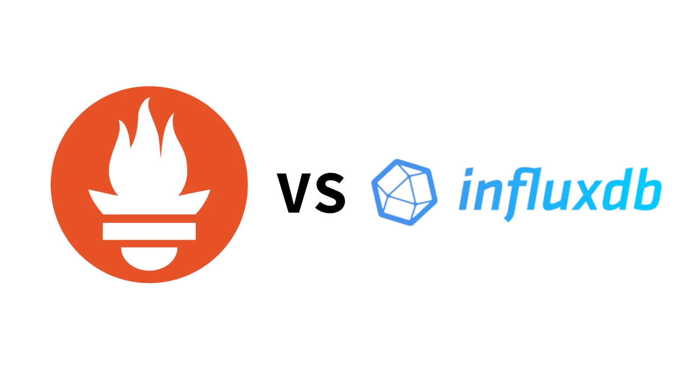

In this blog post, I will explain the differences between monitoring your
infrastructure using Prometheus vs InfluxDB. Both those databases enable you to
gather metrics from your environment and make it possible to monitor even the
most complicated environments. So far in my professional career, I have used
both of those databases, and based on my experience, I will explain some of the
key differences between them.

# General information

Prometheus is a general-purpose monitoring solution aimed at the fast detection
of problems with the environment. Data is stored in Prometheus by default only
for 15 days, and this is because Prometheus isn't intended for long-term
storage. Admins and DevOps can use Prometheus to have reliable and
easy-to-set-up monitoring of their data centers. There are 3 main parts of the
Prometheus monitoring stack:
- Prometheus server
- Alert Manager  server - used for aggregating and sending alerts
- Push Gateway server - gives the ability to gather stats from short-living jobs
that report metrics on exit

Prometheus has a built-in dashboard, but it is very simple and limited in usage.

InfluxDB is a time series database that can be used to store and aggregate all
kinds of values that change over time. It is not limited to monitoring a Linux
server's environment, but most of its use cases lie in this area. Influx can
store data for a very long and due to built-in aggregation rules it can do it in
a very efficient way. There is an advanced build in the dashboard which allows
users to browse data and visualize it in different ways. We can configure build
in authorization module and generate an access token for tools like `telegraf`
or `grafana` to limit access to data. InfluxDB has a built-in jobs scheduler
that can transform your data in configured periods. Altering is enabled out of
the box and can be configured from the dashboard.

# Configuration

Prometheus is configured by the YAML file. You can set up a list of target
systems to be scrapped. There is also another file `prometheus.rules` to add
alert conditions and configure alerting channels such as Slack. The
configuration file is very easy to generate. If you use some kind of deployment
automation such as Ansible, you can set up all your target hosts where
Prometheus should connect very easily.

On the other hand, the configuration of InfluxDB is done by HTTP API calls. Most
of the time, we use the built-in client command line tool `influx` or dashboard
that also comes included this InfluxDB. This approach makes it rather hard to
automate the setup of InfluxDB. You need to create a bash script with a list of
`influx` commands. Then you run this script to configure InfluxDB. Also, it is
hard to make sure your configuration changes are idempotent because you can
invoke such a script multiple times.

# Data Gathering

Prometheus is pulling the data from endpoints configured in the YAML file. It is
doing that in set intervals. There has to be a network connection from the
Prometheus server to the destination endpoint for this to work. Those endpoints
need to produce metrics in the right form, so Prometheus can understand them. To
achieve that, the user usually deploys special services called `exporters` to
servers that can gather metrics and expose them to be fetched by Prometheus.
Examples of those services are:
- node_exporter - for gathering metrics about CPU / RAM usage
- mysqld_exporte - which is producing stats for MySQL database
- haproxy_exporter - same as above but for HAProxy load balancer

InfluxDB has a different way of gathering data. It uses a special service named
`telegraf`. This program is sending data to InfluxDB, so it is another way
around compared to Prometheus.  It has a lot of built-in extensions for
gathering different kinds of data from a lot of sources. There is a standard set
of options for sending CPU / RAM / Disc usage just like in Prometheus and many
more. You can even execute your custom scripts and save your data, as far as it
is in the correct format. This way of data gathering has the advantage in a
dynamic environment where your services are created and destroyed on demand and
configuration of such dynamic service requires additional configuration in
Prometheus. Also, when income traffic from the monitoring server to your cluster
is not possible due to network policy, you can you InfluxDB without problems.

# Data Storage

Data in Prometheus is stored in time-series tables grouped by various dimensions
based on labels such as host or URL. Labels are used for data filtering and
grouping. Old data is automatically discarded based on the maximum size of the
database or the age of the data. Those two parameters are configured during
server start and the user can pass them via the command line. They are global
and can not be changed for each metric. The size of the database depends on the
number of metrics and the number of unique labels.

InfluxDB is storing data in logical namespaces called `buckets`. Each bucket has
configured a retention period that is working similarly to global age-based old
data discarding in Prometheus. In those buckets, users can create individual
metrics and add tags to them. Tags give us the ability to filter and group our
data. Having multiple buckets, users can add jobs inside InfluxDB that fill
periodically aggregate data from one bucket to another. In this way, you can
subsample your metrics for long storage, where data meant for 1-year storage
will have a resolution of 1 day whereas data for 1 month will have a 1-hour
resolution.

# Data Access

Prometheus uses the `PromQL` query language, which is both simple and powerful.
You can query for value in individual metrics and filter them based on label
values. Example of such query: ```
http_requests_total{job="prometheus",group="canary"} ``` Here, we use the
http_requests_total metric and filter it by job and group. You can add the
results of many queries to themselves and combine the final results in many
ways. All alerts that can be configured in Prometheus are based on the PromQL
query. An alert condition is in the simplest form just a comparison of the query
result to a given threshold. Prometheus's queries are leaning toward a
declarative approach to data retrieval.

InfluxDB is using a more advanced query language named `FluxQL`. This is the
predecessor of the old SQL-like query language `InfluxQL` used in InfluxDB
before version 2.0. FluxQL is based on stream-like data transformations, where
the user defines all steps that need to be run to format data incorrectly way.
Example of such a `FluxQL` query:

```flux
from(bucket: "example-bucket")
    |> range(start: -1h)
    |> filter(fn: (r) => r._measurement == "example-measurement" and r.tag == "example-tag")
    |> filter(fn: (r) => r._field == "example-field")
```

Here we can see that our data is taken from a bucket named `example-bucket` then
we take a range starting 1 hour age. Next, we filter by measurement and tag and
finally by field. As we can see, the query is much more complicated than
Prometheus one, but this is because InfluxDB is a general-purpose time series
database, and operations such as time range queries are must-haves in such
software. FluxQL is more imperative like query language that PromQL because we
need to specify all steps needed to access our data. Prometheus database
software automatically assumes a lot of things about our query, and we don't
have to give all the steps.

# References

- https://prometheus.io/
- https://docs.influxdata.com/influxdb/v2.4/
